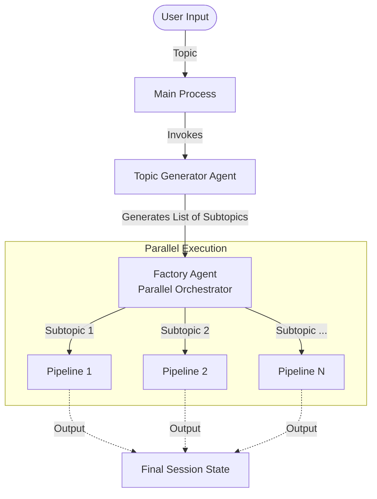
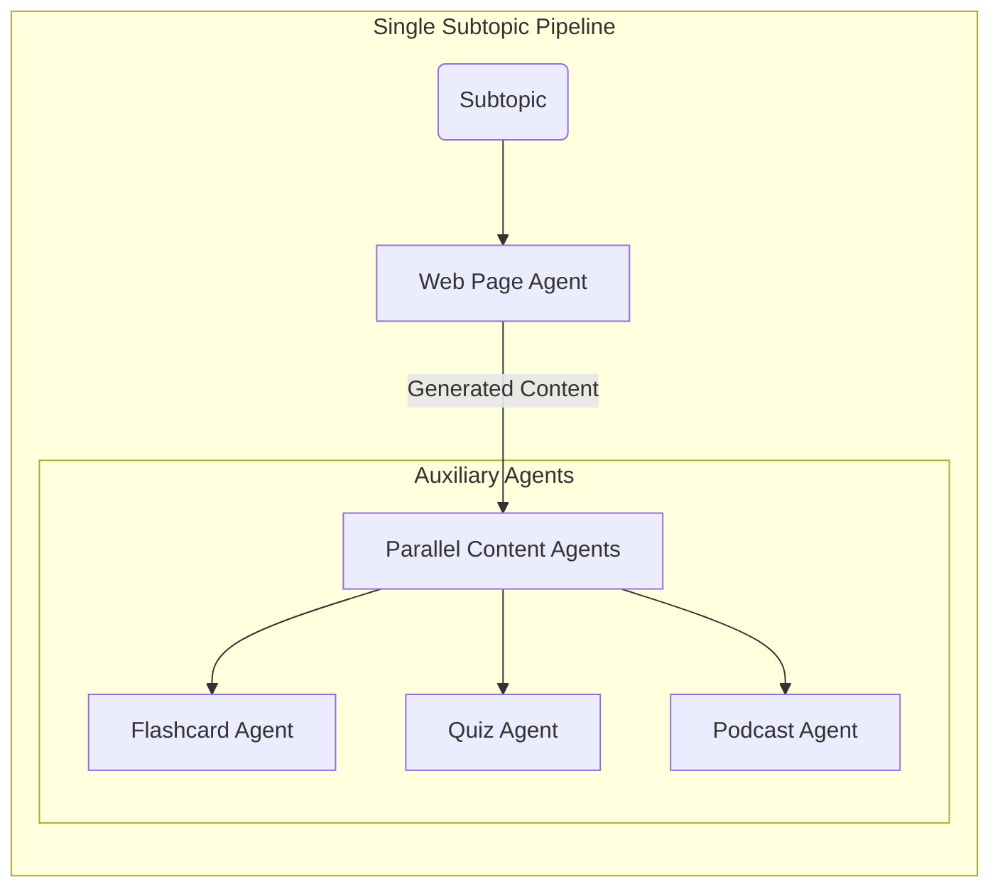

# Acharya - AI Teacher Agent

Acharya is an advanced, multi-agent AI system designed to act as a comprehensive educational content generator. By leveraging the Google Agent Development Kit (ADK) and Gemini models, Acharya takes a single user-provided topic and autonomously creates a complete learning module consisting of structured web pages, flashcards, quizzes, and podcast scripts.

## 🚀 Features

-   **Intelligent Topic Breakdown**: Automatically creates a structured curriculum by breaking down a broad topic into logical subtopics.
-   **Multi-Format Content Generation**:
    -   **Web Page Content**: Educational articles with clear structure and depth.
    -   **Flashcards**: Key concepts extracted for retention.
    -   **Quizzes**: Multiple-choice questions to test understanding.
    -   **Podcasts**: Engaging, conversational scripts between two AI hosts (Alice & Bob).
-   **Parallel Execution**: Utilizes parallel agents to generate content for multiple subtopics simultaneously, significantly reducing wait times.

## 📂 Folder Structure

The core logic resides in the `teacher_agent` directory. Below is the structure of the agent system:

```text
teacher_agent/
├── __init__.py                # Package initialization
└── sub_agents/                # Collection of specialized agents
    ├── factory_agent/         # Orchestrates parallel execution for all subtopics
    ├── flashcard_agent/       # Generates flashcards from web page content
    ├── flashcard_quiz_podcast_agent/ # Parallel agent wrapper for auxiliary content
    ├── podcast_agent/         # Generates conversational podcast scripts
    ├── quiz_agent/            # Generates multiple-choice quizzes
    ├── topic_generator_agent/ # breaks the main topic into subtopics
    ├── web_page_agent/        # Writes the core educational text
    └── web_page_content_function/ # Helper function to build the agent pipeline
```

## 🔄 Agent Workflow

The system follows a hierarchical and parallel workflow to maximize efficiency and coherence.

### High-Level Workflow

1.  **Input**: User provides a topic (e.g., "Quantum Physics").
2.  **Topic Generation**: The `topic_generator_agent` analyzes the topic and produces a list of subtopics (e.g., "Wave-Particle Duality", "Schrödinger's Cat").
3.  **Orchestration**: The `factory_agent` dynamically creates a processing pipeline for *each* subtopic.
4.  **Parallel Execution**: All subtopic pipelines run simultaneously.
5.  **Aggregation**: Results are collected and saved to the session state.

### Subtopic Pipeline (Detailed)

For each subtopic, a specific sequence of agents is executed:

1.  **Web Page Agent**: First, it researches and writes the core content.
2.  **Parallel Content Generation**: Once the text is ready, three agents run in parallel, using the text as source material:
    -   **Flashcard Agent**: Extracts facts.
    -   **Quiz Agent**: Creates questions.
    -   **Podcast Agent**: Scripts a discussion.

### Workflow Diagram



### Subtopic Pipeline Detail




## 🛠️ Agents Description

| Agent Name | Type | Responsibility |
| :--- | :--- | :--- |
| **Topic Generator** | `LlmAgent` | Breaks main topics into 5-10 subtopics to ensure comprehensive coverage. |
| **Factory Agent** | `ParallelAgent` | The "manager" that spins up a worker pipeline for every subtopic found. |
| **Subtopic Pipeline** | `SequentialAgent` | Orchestrates the flow for a single subtopic: First writes content, then triggers auxiliary agents. |
| **Web Page Agent** | `LlmAgent` | The primary content creator. It writes the detailed article. |
| **Flashcard Agent** | `LlmAgent` | Scans the article to create Q&A pairs for memorization. |
| **Quiz Agent** | `LlmAgent` | Creates distinct multiple-choice questions to test comprehension. |
| **Podcast Agent** | `LlmAgent` | Converts the article into a fun, 2-person dialogue script optimized for TTS. |

## ⚙️ Key Implementation Details

1.  **Strict Output Enforcement**:
    -   We utilize **Pydantic** models (e.g., in `TopicGenerator`) to strictly enforce JSON output via the `output_schema` parameter. This guarantees that the LLM's response is always machine-parseable and follows the expected structure (e.g., `list[str]` for subtopics).

2.  **Dynamic Parallelism**:
    -   The system doesn't rely on a fixed number of agents. It uses a **Factory Pattern** where agents are dynamically instantiated at runtime based on the number of subtopics generated.
    -   We use a `count` variable and loop index to strictly assign unique names (e.g., `web_page_content_function_agent_1`) to each dynamically created agent. This prevents state collisions in the parallel execution environment.

3.  **Rate Limiting Strategy**:
    -   To respect API quotas when spinning up 10+ concurrent agents, we intentionally introduce `asyncio.sleep(60)` delays between major pipeline stages. This ensures the system remains stable and does not trigger `429 Too Many Requests` errors.

## 🚀 How to Run

1.  Ensure you have the required environment variables set (Google API Key).
2.  Run the main entry point:

```bash
python main.py
```

3.  Enter your desired topic when prompted.

## Contributing
Feel free to raise an issue or submit a pull request if you find any mistakes or have suggestions for improvement. Your contributions are welcome and appreciated!

---

Happy Coding!