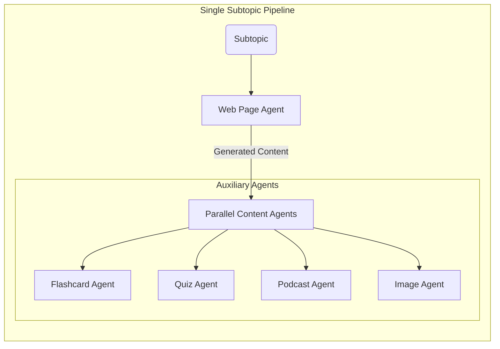

# Acharya - AI Teacher Agent

Acharya is an advanced, multi-agent AI system designed to act as a comprehensive educational content generator. By leveraging the Google Agent Development Kit (ADK) and Gemini models, Acharya takes a single user-provided topic and autonomously creates a complete learning module consisting of structured web pages, flashcards, quizzes, and podcasts.

## 🚀 Features

-   **Intelligent Topic Breakdown**: Automatically creates a structured curriculum by breaking down a broad topic into logical subtopics.
-   **Multi-Format Content Generation**:
    -   **Web Page Content**: Educational articles with clear structure and depth.
    -   **Flashcards**: Key concepts extracted for retention.
    -   **Quizzes**: Multiple-choice questions to test understanding.
    -   **Podcasts**: Engaging conversations between two AI hosts (Alice & Bob).
    -   **Images**: Relevant visual aids sourced and downloaded automatically.
-   **Parallel Execution**: Utilizes parallel agents to generate content for multiple subtopics simultaneously, significantly reducing wait times.

## 🎥 Demo Video

Watch Acharya in action:

https://github.com/user-attachments/assets/dd0c7b45-9369-44c8-8fb0-44cd6063a3e4

> **Note**: The video demonstrates the complete workflow from topic input to content generation across all formats.

## 📂 Folder Structure

The core logic resides in the `teacher_agent` directory. Below is the structure of the agent system:

```text
teacher_agent/
├── __init__.py                # Package initialization
└── sub_agents/                # Collection of specialized agents
    ├── factory_agent/         # Orchestrates parallel execution for all subtopics
    ├── flashcard_agent/       # Generates flashcards from web page content
    ├── flashcard_quiz_podcast_agent/ # Parallel agent wrapper for auxiliary content
    ├── image_agent/           # Searches and downloads relevant images using SerpAPI
    ├── podcast_agent/         # Generates conversational educational podcasts
    ├── quiz_agent/            # Generates multiple-choice quizzes
    ├── topic_generator_agent/ # Breaks the main topic into subtopics
    ├── web_page_agent/        # Writes the core educational text
    └── web_page_content_function/ # Helper function to build the agent pipeline
```

## 🔄 Agent Workflow

The system follows a hierarchical and parallel workflow to maximize efficiency and coherence.

### High-Level Workflow

1.  **Input**: User provides a topic (e.g., "Quantum Physics").
2.  **Topic Generation**: The `topic_generator_agent` analyzes the topic and produces a list of subtopics (e.g., "Wave-Particle Duality", "Schrödinger's Cat").
3.  **Orchestration**: The `factory_agent` dynamically creates a processing pipeline for *each* subtopic.
4.  **Parallel Execution**: All subtopic pipelines run simultaneously.
5.  **Aggregation**: Results are collected and saved to the session state.

### Subtopic Pipeline (Detailed)

For each subtopic, a specific sequence of agents is executed:

1.  **Web Page Agent**: First, it researches and writes the core content.
2.  **Parallel Content Generation**: Once the text is ready, four agents run in parallel, using the text as source material:
    -   **Flashcard Agent**: Extracts facts.
    -   **Quiz Agent**: Creates questions.
    -   **Podcast Agent**: Scripts a discussion and converts it into a podcast.
    -   **Image Agent**: Searches for and downloads relevant images.

### Workflow Diagram


### Subtopic Pipeline Detail




## 🛠️ Agents Description

| Agent Name | Type | Responsibility |
| :--- | :--- | :--- |
| **Topic Generator** | `LlmAgent` | Breaks main topics into 5-10 subtopics to ensure comprehensive coverage. |
| **Factory Agent** | `ParallelAgent` | The "manager" that spins up a worker pipeline for every subtopic found. |
| **Subtopic Pipeline** | `SequentialAgent` | Orchestrates the flow for a single subtopic: First writes content, then triggers auxiliary agents. |
| **Web Page Agent** | `LlmAgent` | The primary content creator. It writes the detailed article. |
| **Flashcard Agent** | `LlmAgent` | Scans the article to create Q&A pairs for memorization. |
| **Quiz Agent** | `LlmAgent` | Creates distinct multiple-choice questions to test comprehension. |
| **Podcast Agent** | `LlmAgent` | Converts the article into a fun, 2-person dialogue script and then converts it into a podcast using Gemini TTS. |
| **Image Agent** | `LlmAgent` | Searches for relevant images using SerpAPI and downloads them locally for visual learning aids. |

## ⚙️ Key Implementation Details

1.  **Strict Output Enforcement**:
    -   We utilize **Pydantic** models (e.g., in `TopicGenerator`) to strictly enforce JSON output via the `output_schema` parameter. This guarantees that the LLM's response is always machine-parseable and follows the expected structure (e.g., `list[str]` for subtopics).

2.  **Dynamic Parallelism**:
    -   The system doesn't rely on a fixed number of agents. It uses a **Factory Pattern** where agents are dynamically instantiated at runtime based on the number of subtopics generated.
    -   We use a `count` variable and loop index to strictly assign unique names (e.g., `web_page_content_function_agent_1`) to each dynamically created agent. This prevents state collisions in the parallel execution environment.

3.  **Retry Mechanism**:
    -   **Podcast Agent**: Implements exponential backoff with 3 retry attempts for TTS generation to handle API disconnects and 503 errors.
    -   **Image Agent**: Uses multi-source fallback (tries up to 5 different images) with 3 retries per source to ensure reliable image downloads.

4.  **Rate Limiting Strategy**:
    -   To respect API quotas when spinning up 10+ concurrent agents, we intentionally introduce `asyncio.sleep(30)` delays between major pipeline stages. This ensures the system remains stable and does not trigger `429 Too Many Requests` errors.

## 🚀 How to Run

### Option 1: Command Line Interface

1.  Ensure you have the required environment variables set in `.env` file:
    ```bash
    GOOGLE_API_KEY=your_api_key_here
    SERPAPI_API_KEY=your_serpapi_key_here
    ```

2.  Install dependencies:
    ```bash
    pip install -r requirements.txt
    ```

3.  Run the main entry point:
    ```bash
    python main.py
    ```

4.  Enter your desired topic when prompted.

### Option 2: Web Interface (Recommended)

For a better user experience with real-time progress updates and visual content display:

#### Prerequisites
- Python 3.10+
- Node.js 16+ and npm

#### Step 1: Start the Backend API Server

1.  Open a terminal in the project root directory
2.  Install Python dependencies:
    ```bash
    pip install -r requirements.txt
    ```

3.  Start the FastAPI server:
    ```bash
    python api_server.py
    ```

    The API server will start on `http://localhost:8000`

#### Step 2: Start the Frontend Development Server

1.  Open a **new terminal** window
2.  Navigate to the frontend directory:
    ```bash
    cd frontend
    ```

3.  Install Node.js dependencies (first time only):
    ```bash
    npm install
    ```

4.  Start the development server:
    ```bash
    npm run dev
    ```

    The frontend will start on `http://localhost:5174` (or `5173`)

#### Step 3: Use the Application

1.  Open your browser and navigate to `http://localhost:5174`
2.  Enter a topic in the input field
3.  Watch as content is generated progressively:
    - Subtopics appear first
    - Content fills in as each agent completes
    - Progress updates shown in real-time

> **Note:** If you encounter timeout errors or incomplete content generation, this may be caused by aggressive rate limiting delays in the agent pipeline. As an alternative, try using the terminal version (`python main.py`) which provides better visibility into the generation process, or wait a few minutes and retry your request.

## Contributing
Feel free to raise an issue or submit a pull request if you find any mistakes or have suggestions for improvement. Your contributions are welcome and appreciated!

---

Happy Coding!